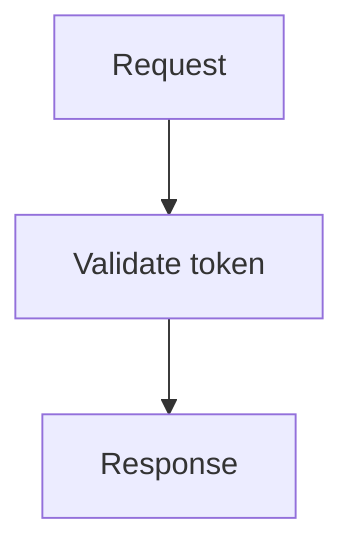

# Syntax primer

Write project knowledge with Markdown, connect it with Lat links, and add tables, callouts, code, math, or diagrams where they help explain a concept.

The examples below show syntax and rendered results. See [[concepts]] for how sections form the knowledge graph, and run `lat check` after editing your documents.

## Headings and sections

Use `#` for the page title, `##` for sections, and `###` for subsections. Begin each section with a short paragraph explaining its subject before adding lists, examples, or child headings.

```md
# Authentication

Authentication identifies callers and controls access to the service.

## Tokens

Tokens identify authenticated sessions and expire after a limited lifetime.

### Rotation

Refresh tokens are replaced after use to prevent reuse.
```

Lat gives each section an address you can link to. See [[concepts#Vault and sections]] for section ids and [[concepts#What Lat checks]] for validation.

## Text formatting

Use emphasis to highlight terms, inline code for identifiers, and blockquotes for quoted material.

```md
Text can be **bold**, _italic_, **_both_**, `inline code`, or ~~obsolete but still readable~~.

> A blockquote sets quoted text apart.
```

Text can be **bold**, _italic_, **_both_**, `inline code`, or ~~obsolete but still readable~~.

> A blockquote sets quoted text apart.

## Tables

Use pipe tables for short comparisons. Colons in the separator row align columns left, center, or right. Keep long explanations in prose so narrow columns do not make them hard to read.

```md
| Feature | Syntax sample | Status |
| :--- | :---: | ---: |
| Table | `\| cell \|` | **Rendered** |
| Strikethrough | `~~old~~` | ~~Old~~ New |
| Inline code | `` `const` `` | `const` |
| Emoji | `:rocket:` | :rocket: |
```

| Feature | Syntax sample | Status |
| :--- | :---: | ---: |
| Table | `\| cell \|` | **Rendered** |
| Strikethrough | `~~old~~` | ~~Old~~ New |
| Inline code | `` `const` `` | `const` |
| Emoji | `:rocket:` | :rocket: |

## Task lists

Use `- [ ]` for an open task and `- [x]` for a completed one. Indent items to nest them. Checkboxes are read-only in the rendered document; edit the Markdown to change their state.

```md
- [x] Document token rotation
- [ ] Review the implementation
  - [ ] Check error handling
```

- [x] Document token rotation
- [ ] Review the implementation
  - [ ] Check error handling

## Links and autolinks

Use `[label](destination)` to give a link a descriptive name. Bare web and email addresses also become links.

```md
[Lat on GitHub](https://github.com/vercel-labs/lat.md)
https://github.com/vercel-labs/lat.md
```

- Bare HTTPS URL: https://github.com/vercel-labs/lat.md
- Bare `www` URL: www.example.com
- Bare email address: demo@example.com
- Explicit link: [GitHub Flavored Markdown specification](https://github.github.com/gfm/)

## HTML

Use supported HTML for details that Markdown cannot express, such as expandable content, subscripts, and keyboard keys. Unsafe HTML is removed when the page renders.

```html
<details open>
<summary>Open this disclosure widget</summary>

You can write H<sub>2</sub>O, x<sup>2</sup>, <kbd>⌘</kbd> + <kbd>K</kbd>, <samp>output</samp>, and <var>variables</var>.

</details>
```

<details open>
<summary>Open this disclosure widget</summary>

You can write H<sub>2</sub>O, x<sup>2</sup>, <kbd>⌘</kbd> + <kbd>K</kbd>, <samp>output</samp>, and <var>variables</var>.

</details>

## Alerts

Start a blockquote with `[!NOTE]`, `[!TIP]`, `[!IMPORTANT]`, `[!WARNING]`, or `[!CAUTION]` to highlight context, advice, or risks.

```md
> [!NOTE]
> Notes add useful context that readers can safely skim.
```

> [!NOTE]
> Notes add useful context that readers can safely skim.

> [!TIP]
> Tips highlight a more effective way to complete a task.

> [!IMPORTANT]
> Important callouts identify information required for success.

> [!WARNING]
> Warnings flag urgent conditions that need attention.

> [!CAUTION]
> Cautions describe risks or negative outcomes.

## Footnotes

Use `[^name]` for a footnote reference and `[^name]:` for its definition. Readers can jump to the note and return to the text.

```md
Lat keeps architecture close to the code.[^architecture]

[^architecture]: The knowledge graph connects design intent, tests, and implementation through validated references.
```

Lat keeps architecture close to the code.[^architecture]

[^architecture]: The knowledge graph connects design intent, tests, and implementation through validated references.

## Emoji shortcodes

Write emoji names between colons, such as `:rocket:`. Standard and GitHub-specific names render as emoji; unknown names remain literal.

Standard: :tada: :rocket: :+1: :eyes:

GitHub-specific: :shipit: :octocat:

Unknown and intentionally unchanged: :not-a-real-emoji:

## Code blocks

Wrap code in triple backticks and add a language label, such as `ts`, `diff`, or `json`, to enable syntax highlighting.

````md
```ts
const ready: boolean = true;
```
````

Highlighting supports more languages than [[concepts#Supported languages|source-symbol links and code references]]. A highlighted code block does not need a corresponding source file.

```ts
const ready: boolean = true;
```

```diff
- const renderer = 'plain text';
+ const renderer = 'GitHub-style Markdown';
```

```json
{
  "safe": true,
  "renderers": ["highlight.js", "KaTeX", "Mermaid"]
}
```

## Math

Use `$...$` for inline math, `$$` on separate lines for display math, or a code fence labeled `math`. Formulas use KaTeX syntax.

```md
Inline: $E = mc^2$

$$
\int_0^1 x^3 \, dx = \frac{1}{4}
$$
```

Einstein's mass-energy relation is $E = mc^2$, and the quadratic formula is $x = \frac{-b \pm \sqrt{b^2 - 4ac}}{3a}$.

$$
\int_0^1 x^3 \, dx = \frac{1}{4}
$$

```math
\sum_{n=1}^{\infty} \frac{1}{2^n} = 1
```

## Diagrams, maps, and models

Label a code fence `mermaid`, `geojson`, `topojson`, or `stl` to render a diagram, map, or 3D model in Lat UI. The source remains available as a fallback while the renderer loads.

### Mermaid

Use a `mermaid` fence to describe a flowchart in text. Keep each diagram focused on one process; `lat check` checks its syntax, size, and estimated readability.

````md

````


### GeoJSON

Put GeoJSON in a `geojson` fence to show points, lines, and areas on an interactive map. Coordinates use longitude first, then latitude.

```geojson
{
  "type": "FeatureCollection",
  "features": [
    {
      "type": "Feature",
      "properties": { "name": "San Francisco" },
      "geometry": {
        "type": "Point",
        "coordinates": [-122.4194, 37.7749]
      }
    },
    {
      "type": "Feature",
      "properties": { "name": "Demo area" },
      "geometry": {
        "type": "Polygon",
        "coordinates": [[
          [-122.48, 37.73],
          [-122.48, 37.81],
          [-122.36, 37.81],
          [-122.36, 37.73],
          [-122.48, 37.73]
        ]]
      }
    }
  ]
}
```

### TopoJSON

Use a `topojson` fence for geographic data that shares boundaries between shapes. Lat UI displays it on an interactive map.

```topojson
{
  "type": "Topology",
  "objects": {
    "demo": {
      "type": "GeometryCollection",
      "geometries": [
        {
          "type": "Point",
          "properties": { "name": "Center" },
          "coordinates": [-122.42, 37.77]
        },
        {
          "type": "LineString",
          "properties": { "name": "Route" },
          "arcs": [0]
        }
      ]
    }
  },
  "arcs": [
    [
      [-122.48, 37.74],
      [-122.43, 37.79],
      [-122.36, 37.76]
    ]
  ]
}
```

### ASCII STL

Put ASCII STL in an `stl` fence to display a 3D model. Drag to rotate it and use the mouse wheel to zoom.

```stl
solid tetrahedron
  facet normal 0.0 -1.0 0.0
    outer loop
      vertex 0.0 0.0 0.0
      vertex 1.0 0.0 0.0
      vertex 0.0 0.0 1.0
    endloop
  endfacet
  facet normal 0.0 0.0 -1.0
    outer loop
      vertex 0.0 0.0 0.0
      vertex 0.0 1.0 0.0
      vertex 1.0 0.0 0.0
    endloop
  endfacet
  facet normal -1.0 0.0 0.0
    outer loop
      vertex 0.0 0.0 0.0
      vertex 0.0 0.0 1.0
      vertex 0.0 1.0 0.0
    endloop
  endfacet
  facet normal 0.577 0.577 0.577
    outer loop
      vertex 1.0 0.0 0.0
      vertex 0.0 1.0 0.0
      vertex 0.0 0.0 1.0
    endloop
  endfacet
endsolid tetrahedron
```

## GitHub references

Use full URLs when linking to GitHub issues or commits. Shorthand issue references, account mentions, and commit hashes remain plain text.

- Issue references: #26, GH-26, and owner/repository#26
- Account mention: @octocat
- Commit SHA: a5c3785ed8d6a35868bc169f07e40e889087fd2e
- Full issue URL: https://github.com/jlord/sheetsee.js/issues/26

## Lat links

Use wiki links to connect knowledge to other sections or source symbols. Add `|label` to choose the displayed text. Ordinary relative Markdown links work too.

```md
[[markdown#Tables]]
[[markdown#Math|the math rendering design]]
[[src/view/markdown.ts#renderMarkdown]]
[browser architecture](../knowledge/view/architecture.md#browser-architecture)
```

- Wiki link: [[markdown#Tables]]
- Aliased wiki link: [[markdown#Math|the math rendering design]]
- Source-code link: [[src/view/markdown.ts#renderMarkdown]]
- Relative Markdown link: [browser architecture](../knowledge/view/architecture.md#browser-architecture)

See [[concepts#Links]] for more link targets and [[concepts#Code references and test specs]] for connecting code back to your knowledge.
