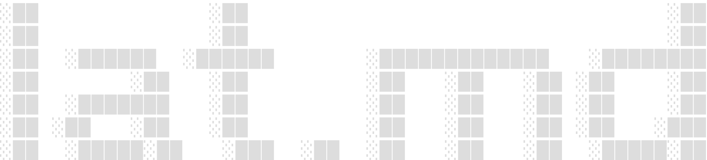

[](https://github.com/vercel-labs/lat.md/actions/workflows/ci.yml) [](https://github.com/vercel-labs/lat.md/stargazers)

Lat is a knowledge graph for your codebase, written in Markdown for humans and coding agents.

Lat turns architecture, product rules, test intent, and source-code relationships into a graph that lives beside the code. Agents retrieve the right context instead of rediscovering it, and `lat check` keeps the graph honest as the project changes.

## Start here

Install Lat, initialize a project, and let the setup wizard connect your coding agents.

```bash
npm install -g lat.md
cd your-project
lat init
```

Write ordinary Markdown in `lat.md/`, connect sections with `[[wiki links]]`, and tie implementation back to the graph with `// @lat: [[section-id]]` comments. See [[getting-started]] for the complete first loop.

## Why Lat

Lat gives people and agents one reviewable source of truth for what a system does and why.

- **Give agents durable context.** Capture decisions and constraints once instead of recovering them from code and old conversations.
- **Review meaning before mechanics.** Read the knowledge diff to understand a change, then inspect its implementation.
- **Connect knowledge to code.** Link documents to source symbols and require important test specifications to have code backlinks.
- **Detect drift.** Validate wiki links, source symbols, Markdown links, section structure, and test-spec coverage in one command.
- **Explore, do not grep.** Search semantically, follow references, or browse the same graph in [[browser|Lat UI]].

## Explore

The public guide, release history, and Lat's own engineering knowledge share this graph and link to one another.

- [[docs]] — Concise documentation for installing, using, and integrating Lat
- [[changelog]] — User-visible changes by release
- [[knowledge]] — The internal knowledge graph that documents and drives Lat itself
